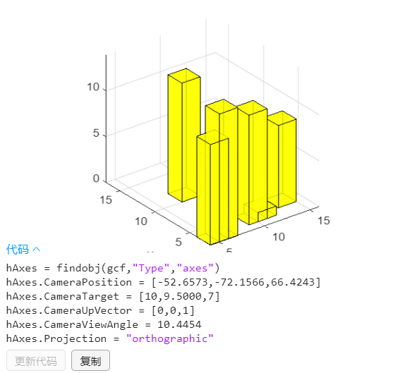

# matlab相关函数使用

## matlab 多目标最优 paretosearch

```matlab
%main.m
clc
clear
fun=@(x)func_temp(x);
A=[-1 0;
   0 -1];
b=[-1 ;-2];
x=paretosearch(fun,2,A,b);
plot(x(:,1),x(:,2),'m*');
xlabel('x(1)');
ylabel('x(2)');
```

```matlab
%func_temp.m
function f=func_temp(x)
    f(1)=x(1)+x(2);
    f(2)=2*x(2)+x(2);
end
```

## 三维空间中的汉字

```matlab
text(x,y,z,'string')
```

> [matlab如何在三维图形中添加汉字注释？_百度知道 (baidu.com)](https://zhidao.baidu.com/question/1431159674541927179.html)

## 绘制圆形

> [Matlab------在Matlab中如何画圆_matlab画圆函数-CSDN博客](https://blog.csdn.net/qq_40505953/article/details/104778359)

## 让原点在右上角，x轴向左，y轴向右

```matlab
set(gca, 'XDir', 'reverse');  % x 轴方向反转
set(gca, 'YDir', 'reverse');  % y 轴方向反转
set(gca, 'XAxisLocation', 'top');  % x 轴在顶部
set(gca, 'YAxisLocation', 'right');  % y 轴在右侧
```

## 要沿 *x* 轴和 *y* 轴使用长度相等的数据单位

```
axis equal
```

## 求函数零点

* fzero

```matlab
%fzero_test.m
function h=fzero_test(a)
    h=a^2-9;
end
```

```matlab
%test.m
x0=[2 4];
fzero(@fzero_test,x0) % ans=3
```

## matlab line 宽度，颜色，宽度

```matlab
line([x1,x2],[y1,y2],'LineWidth', 2);
```

## matlab利用最优化解决非线性微分方程

### 使用一次

```matlab
x = optimvar('x');
y = optimvar('y');
x0=struct();
prob = optimproblem("Objective",peaks(x,y));

prob.Constraints.cons1 = x^2 + y^2 == 4;
prob.Constraints.cons2 = x^2 - y^2 == 0;
prob.Constraints.cons3 = x>=0;
prob.Constraints.cons4 = y>=0;
x0.x = 1;
x0.y = -1;
sol = solve(prob,x0)
```

> 约束不支持

### 当需要进行迭代时

```matlab
x = optimvar('x');
y = optimvar('y');
x0=struct();
prob = optimproblem("Objective",peaks(x,y));

prob.Constraints.cons1 = x^2 + y^2 == 4;
prob.Constraints.cons2 = x^2 - y^2 == 0;
prob.Constraints.cons3 = x>=0;
prob.Constraints.cons4 = y>=0;
x0.x = 1;
x0.y = 0;
sol = solve(prob,x0)

%允许的
prob = optimproblem("Objective",peaks(x,y));
prob.Constraints.cons1 = x^2 + y^2 == 2;
prob.Constraints.cons2 = x^2 - y^2 == 0;
prob.Constraints.cons3 = x>=0;
prob.Constraints.cons4 = y>=0;
x0.x = 1;
x0.y = 0;
sol = solve(prob,x0)
```


### 参考

>  [基于问题的有约束的非线性方程组 - MATLAB & Simulink - MathWorks 中国](https://ww2.mathworks.cn/help/optim/ug/systems-of-equations-with-constraints-problem-based.html#NonlinearSystemsOfEquationsWithConstraintsProblemBasedExample-1)
> [求解优化问题或方程问题 - MATLAB solve - MathWorks 中国](https://ww2.mathworks.cn/help/optim/ug/optim.problemdef.optimizationproblem.solve.html?s_tid=doc_ta#mw_0da39407-9136-4f31-8f99-3ecb2857cddb)
> [求解优化问题或方程问题 - MATLAB solve - MathWorks 中国](https://ww2.mathworks.cn/help/optim/ug/optim.problemdef.optimizationproblem.solve.html?s_tid=doc_ta)

## 求解非线性方程组

* fsolve()

## matlab绘制datetime与因变量关系图

```matlab
clc
clear
close all
fileName1_1="attach1_1.CSV";
data=readtable(fileName1_1)
% Assuming "data" is your array with missing values
data = rmmissing(data);%清理数据，删除数据丢失的行

time=datetime(table2array(data(:,1)),'InputFormat', 'yyyy-MM-dd HH:mm:ss');
T1=table2array(data(:,2));%table转数值数组
T2=table2array(data(:,3));

figure;
plot(time,T1);%打印
hold on;
plot(time,T2);%打印
hold on;
hold off;
```

##  matlab三维路径规划绘图.md



### 绘制立方体

```matlab
hold on
grid on
plotcube([5 5 5],[ 2 2 2],.8,[1 0 0]);
plotcube([2 1 3],[ 10 10 10],.8,[144/256 144/256 144/256]);
axis([0 2000 0 2000 -200 600 ])   %设置图像的可视化范围

axis equal     % 图像坐标轴可视化间隔相等 
xlabel('x');
ylabel('y');
```

`plotcube([长，宽，高]，[x,y,z坐标] , 透明度0~1 , [r , g ,b 0~1] );`

### 绘制立方柱

```matlab
clc
clear
close all
hold on
grid on
rows=7;
place=randi(15,rows,2);
height=randi(15,rows,1);
for i=1:rows
    plotcube([2,2,height(i)],[place(i,:),0],0.8,[1 1 0]);
end

axis([0 2000 0 2000 -200 600 ])   %设置图像的可视化范围
axis equal     % 图像坐标轴可视化间隔相等 
xlabel('x');ylabel('y');

```

### 自由视角

命令行输入` cameratoolbar`

### 生成随机数矩阵

`randi(max,rows,cols)` 生成rows *cols的1~max的随机数矩阵

## GPU加速

* gpuArray

```matlab
a=[1 2 3;4 5 6 ; 7 8 9];%a在cpu里进行计算
b=gpuArray(a);%b在gpu里进行计算
```

* parfor 并行循环

> [简单看看matlab的GPU加速](https://www.bilibili.com/video/BV1E341167Hf?vd_source=ec4e4974e1b56ed330afdb6c6ead1501)

## 一阶微分方程

* 代码

```matlab
%deal.m
function f=deal(t,y)
    f=(y^2-t-2)/(4*(t+1));
end
```

```matlab
%test.m
[t,y]=ode45('deal',[0,2],0);
plot(t,y);
```

* 效果


* 带参数

```matlab
%直线阻尼器的阻尼系数为常数
function f=myODE(t,x,a)    %a为直线阻尼系数
    k1=1025*9.8*pi*1^2;%静力回复系数
    k2=656.3616;%兴波阻力系数
    k3=80000;%弹簧刚度
    m1=2433;%振子质量
    m2=4866;%浮子质量
    m3=1335.535;%附加质量
    w=1.4005;%入射波浪频率
    f=6250;%垂荡激励力振幅 (N)
    %{
    x1 振子位移，向上为正
    x2 浮子位移，向上为正
    x3=diff(x1)
    x4=diff(x2)
    %}
    f=[
        x(3);
        x(4);
        ( -k3*(x(1)-x(2))-a*(x(3)-x(4)) )/(m1);
        ( f*cos(w*t)-k1*x(2)-k2*x(4)+k3*(x(1)-x(2))+a*(x(3)-x(4)) )/(m2+m3);
    ];
end
```

```matlab
%main.m
[t,x]=ode45(@(t,x)myODE1(t,x,a),[0,40*2*pi/w],[0,0,0,0]);%括号一
```

> 可正常运行

## 一阶微分方程组

```matlab
function f=deal(t,y)
    f=[1;y(1)];
end
```

```matlab
options = odeset('MaxStep', 1);
[t,y]=ode45('deal',[0,10],[0,0],options);
figure;
hold on;
plot(t,y(:,2));
```

* 效果


## 获取矩阵最大/最小元素及索引

```matlab
[power_max,power_pos]=max(power_sum);
[maxVal, linearIndex] = max(power_sum(:));% 获取最小值和线性索引
[row, col] = ind2sub(size(power_sum), linearIndex);% 将线性索引转换为行列索引
```

## 绘制等高地形图，深度图，高度图

```matlab
filename='attach.xlsx';
data=readtable(filename);

south_north=table2array(data(2:end,1));
west_east=table2array(data(1,2:end));
depth=table2array(data(2:end,2:end));

%海水深度
figure;
surf(repmat(south_north,1,201),repmat(west_east,251,1),depth);
font_size=15;
title("海水深度",FontSize=font_size+2);
xlabel("从南到北/NM",FontSize=font_size);
ylabel("从西到东/NM",FontSize=font_size);
zlabel("海水深度/m",FontSize=font_size);
shading interp;
saveas(gcf,'land_depth.png');

%海底形状
figure;
surf(repmat(south_north,1,201),repmat(west_east,251,1),-1*depth);
title("海底形状",FontSize=font_size+2);
xlabel("从南到北/NM",FontSize=font_size);
ylabel("从西到东/NM",FontSize=font_size);
zlabel("海拔高度/m",FontSize=font_size);
shading interp;
saveas(gcf,'land_shape.png');

%二维等高地平线
figure;

contourf(repmat(south_north,1,201),repmat(west_east,251,1),-1*depth);
title("海底等高地形图",FontSize=font_size+2);
xlabel("从南到北/NM",FontSize=font_size);
ylabel("从西到东/NM",FontSize=font_size);
zlabel("海水深度/m",FontSize=font_size);
colormap jet; % 设置颜色映射
colorbar; % 添加颜色图例
saveas(gcf,'land_same_height.png');
```


## CSV导入数据，等高散点图

* 法一

```matlab
filename='attach1.csv';
data=readtable(filename, 'VariableNamingRule', 'preserve');
x=table2array(data(:,2));
y=table2array(data(:,3));
z=table2array(data(:,4));

figure;
font_size=15;
scatter3(x, y, z, 20, z, 'filled'); % 36为点的大小，z用于指定颜色
xlabel("x/m",FontSize=font_size);
ylabel("y/m",FontSize=font_size);
zlabel("z/m",FontSize=font_size);
colorbar; % 添加颜色图例
saveas(gcf,"fast.png");
```

* 法二

```matlab
filename='attach1.xls';
data=readtable(filename, 'VariableNamingRule', 'preserve');

wei=data.("任务gps 纬度");
jing=data.("任务gps经度");
```

> 无须再使用table2array

## surf 光滑

```matlab
clc;
clear;
filename='attach1.xlsx';
data=readtable(filename, 'VariableNamingRule', 'preserve');
data=table2array(data);
size=256;

surf(repmat(1:size,size,1)',repmat(1:size,size,1),data);
shading interp; % 启用插值着色
```

