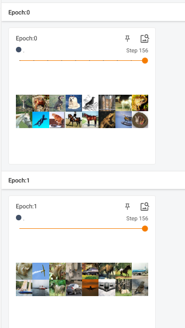
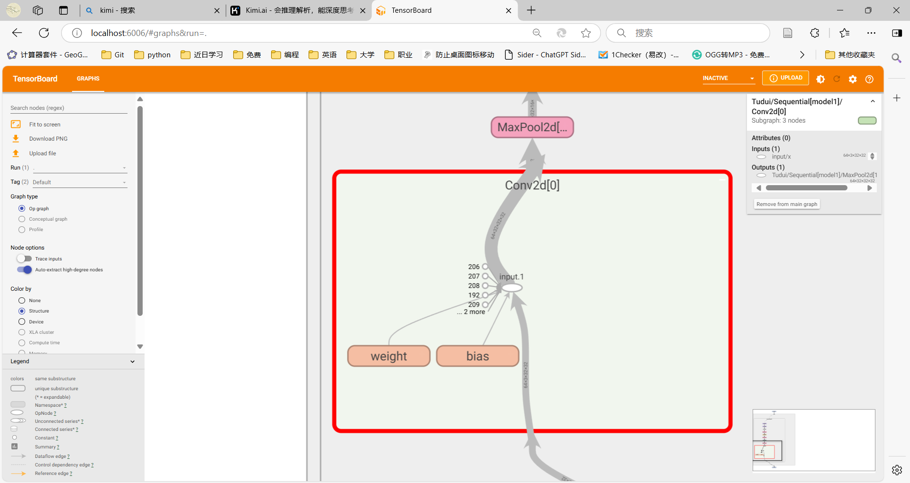
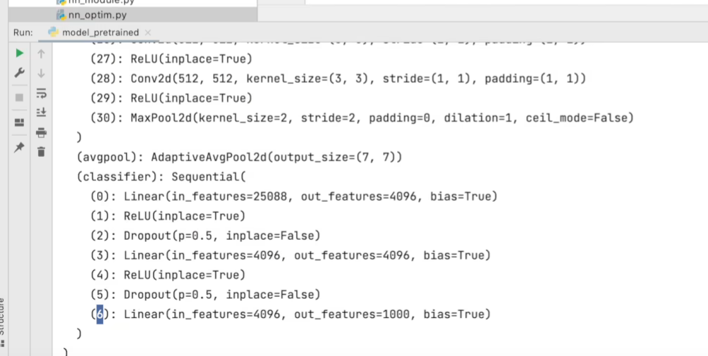

# Pytorch

CUDA Version: 12.7 

Driver Version: 566.14  

torch Version: 1.13.1

conda.exe地址： F:\Users\anaconda3\envs\pytorch\Scripts

## 环境配置

> [PyTorch深度学习快速入门教程（绝对通俗易懂！）](https://www.bilibili.com/video/BV1hE411t7RN?vd_source=ec4e4974e1b56ed330afdb6c6ead1501)

### 查看cuda版本

```shell
nvidia-smi
```

### 进入环境

```shell
conda activate pytorch
```

### 查看库

```shell
pip list
```

### 查看虚拟环境地址

``` shell
conda env list
```

### 查看torch版本

```python
import torch
print(torch.__version__)
print(torch.version.cuda)
```

### 检查配置是否成功

```shell
torch.cuda.is_available()
```

### pycharm选择已有环境

setting->项目->python解释器->添加已有解释器->conda环境->使用先有环境->pytorch->应用

## 手写数字识别

### CNN.py

构建自定义类

```python
import torch


class CNN(torch.nn.Module):  # 继承
    def __init__(self):
        super(CNN, self).__init__()
        self.conv = torch.nn.Sequential(
            # 1.卷积(卷积层)
            torch.nn.Conv2d(1, 32, kernel_size=5,  # 卷积核有32个
                            padding=2),  # h2=(28-5+2*2)/1+1=28
            # 2.归一化(BN层)
            torch.nn.BatchNorm2d(32),
            # 3.激活层 Relu函数
            torch.nn.ReLU(),
            # 4.最大池化
            torch.nn.MaxPool2d(2)  # 池化核的大小 14*14
        );
        self.fc = torch.nn.Linear(in_features=14 * 14 * 32, out_features=10);

    def forward(self, x):
        out = self.conv(x)
        # 将图像展开成一维
        # 输入的张量(n,c,h,w) n为数 c为通道数 c
        out = out.view(out.size()[0], -1)
        out = self.fc(out)
        return out

```


### main.py

用于训练模型

```python
import torch
import torchvision.datasets as dataset
import torchvision.transforms as transforms
import torch.utils.data as data_utils
from CNN import CNN

##### 数据加载

train_data = dataset.MNIST(
    root="mnist",
    train=True,
    transform=transforms.ToTensor(),
    download=True
);

test_data = dataset.MNIST(
    root="mnist",
    train=False,
    transform=transforms.ToTensor(),
    download=True
);

# print(train_data)
# print(test_data)


###分批加载
train_loader = data_utils.DataLoader(dataset=train_data,
                                     batch_size=64,
                                     shuffle=True)  # 打乱下标

test_loader = data_utils.DataLoader(dataset=test_data,
                                    batch_size=64,
                                    shuffle=True)  # 打乱下标

# print(train_loader)
# print(test_loader)
cnn = CNN();

#######损失函数
loss_func = torch.nn.CrossEntropyLoss();

######优化函数
optimizer = torch.optim.Adam(cnn.parameters(), lr=0.01)

####训练过程
# epoch 通常指 一次训练数据全部训练一次
for epoch in range(10):
    for index, (images, labels) in enumerate(train_loader):
        # print(index)
        # print(images)
        # print(labels)

        # 前向传播
        outputs = cnn(images)
        loss = loss_func(outputs, labels);
        # 先清空梯度
        optimizer.zero_grad()
        # 反向传播
        loss.backward()
        optimizer.step()
        print("now round{}, it is {}/{},loss is {}".format(epoch + 1, index + 1, len(train_data) // 64, loss.item()))
        # break
    ###########测试集验证
    loss_test = 0
    rightValue = 0
    for index2, (images, labels) in enumerate(test_loader):
        outputs = cnn(images)
        # print(outputs)
        # print(labels)
        loss_test += loss_func(outputs, labels)
        _, pred = outputs.max(1)
        rightValue += (pred == labels).sum().item()
        # print(pred)
        # 把两个张量中的每一个元素进行对比
        # print((pred == labels).sum().item())
        # break;
        print("当前为第{}轮测试集验证, 当前批次为{}/{},loss为{},准确率是{}".format(epoch + 1, index2 + 1,
                                                                                   len(test_data) // 64, loss_test,
                                                                                   rightValue / len(test_data)))

# torch.save(cnn, "model/mnist_model.pkl")

```

### mnist_test.py

使用模型

```python
import cv2
import torch
import torchvision.datasets as dataset
import torchvision.transforms as transforms
import torch.utils.data as data_utils
from CNN import CNN

test_data = dataset.MNIST(
    root="mnist",
    train=False,
    transform=transforms.ToTensor(),
    download=True
);

test_loader = data_utils.DataLoader(dataset=test_data,
                                    batch_size=64,
                                    shuffle=True)  # 打乱下标

cnn = torch.load("model/mnist_model.pkl")
loss_func = torch.nn.CrossEntropyLoss();
loss_test = 0
rightValue = 0
for index, (images, labels) in enumerate(test_loader):
    outputs = cnn(images)
    _, pred = outputs.max(1)
    loss_test += loss_func(outputs, labels)
    rightValue += (pred == labels).sum().item()

    images = images.numpy()  # batch , c ,h ,w
    labels = labels.numpy()
    pred = pred.numpy()

    for idx in range(images.shape[0]):
        im_data = images[idx]
        im_data = im_data.transpose(1, 2, 0)  # 交换维度，将通道维度移到最后
        im_label = labels[idx]
        im_pred = pred[idx]
        print("预测值为{} 真实值为{}".format(im_pred, im_label))
        cv2.imshow("nowImage", im_data)
        cv2.waitKey(0)  # 弹出窗口时程序停止运行
print("loss为{},准确率是{}".format(loss_test, rightValue / len(test_data)))
print(cv2.__version__)

```

> [实战教学！pytorch实现手写数字识别！](https://www.bilibili.com/video/BV1Vm42137D1?p=2&vd_source=ec4e4974e1b56ed330afdb6c6ead1501)

## Dataset

用于将数据从数据集中打包，然后分批次（batch)进行加载、训练

```python
from torch.utils.data import  Dataset
from PIL import Image
import cv2
import  os
class MyData(Dataset):

    def __init__(self,root_dir,label_dir):
        self.root_dir=root_dir
        self.label_dir=label_dir
        self.path=os.path.join(self.root_dir,self.label_dir)
        self.img_path=os.listdir(self.path)

    def __getitem__(self, idx):
        img_name=self.img_path[idx]
        img_item_path=os.path.join(self.root_dir,self.label_dir,img_name)
        img=Image.open(img_item_path)
        label=self.label_dir
        return img,label

    def __len__(self):
        return len(self.img_path)

root_dir="train"
ants_label_dir="ants"
bees_label_dir="bees"
bees_dataset=MyData(root_dir,bees_label_dir)
ants_dataset=MyData(root_dir,ants_label_dir)

train_dataset=ants_dataset+bees_dataset
```

## TensorBoard

用处是为了打印出loss等或者图片等，以用来监视整个训练过程

### 环境

```shell
pip install tensorboard
```

### 导出log

```python
# 用处是为了打印出loss等或者图片等，以用来监视整个训练过程
from torch.utils.tensorboard import SummaryWriter
import  numpy as np
from PIL import Image

writer =SummaryWriter("logs")
image_path="train/ants/0013035.jpg"
img_PIL=Image.open(image_path)
img_array=np.array(img_PIL)#转化成能用tensorboard打开的图片格式
print(type(img_array))
print(img_array.shape)# (512,768,3)发现通道在最后，与add_image的默认不同

writer.add_image("test",img_array,1,dataformats='HWC')
# y= 2*x
for i in range(100):
    writer.add_scalar("y=2x",2*i,i)

writer.close()
```

### 打开log

终端中输入以下指令。复制链接至浏览器，终端中退出按ctrl+c

```shell
tensorboard --logdir=logs
```

端口选项

```shell
tensorboard --logdir=logs --port=6007
```

## 常用Transforms

是一个用于处理图像的库

* 样例

``` python
from PIL import Image
from torchvision import transforms

# alt+7 打开structure
# ctrl+p方便查看函数参数
# ctrl+alt+l格式化代码

# tensor
img_path = "train/ants/0013035.jpg"
img_path_abs = "G:\\project\\pytorch_train\\dataset\\train\\ants\\0013035.jpg"
img = Image.open(img_path)
print(img)  # 打印图片信息

# transforms如何使用
# transforms是一个工具箱

tensor_trans = transforms.ToTensor()
tensor_img = tensor_trans(img)  # 将图片转为tensor
print(tensor_img)
```

| 输入 | PIL     | Image.open() |
| ---- | ------- | ------------ |
| 输出 | tensor  | ToTensor()   |
| 作用 | narrays | cv.imread()  |

* Totensor

  将图片转成tensor格式

```python
from PIL import Image
from torchvision import transforms
from torch.utils.tensorboard import SummaryWriter

writer = SummaryWriter("logs")
img = Image.open("train/ants/0013035.jpg")
print(img)

# ToTensor
trans_totensor = transforms.ToTensor()  ##工具
img_tensor = trans_totensor(img)
writer.add_image("ToTensor", img_tensor)
write.close()
```

* Normalize

  标准化，可以参考正太分布变为标准正太分布的过。

  writer.add_iamge()的第三个参数用于将该图片放置在第几step

```python
from PIL import Image
from torchvision import transforms
from torch.utils.tensorboard import SummaryWriter

writer = SummaryWriter("logs")
img = Image.open("train/ants/0013035.jpg")
print(img)

trans_totensor = transforms.ToTensor()  ##工具
img_tensor = trans_totensor(img)

#Normalize
print(img_tensor[0][0][0])
trans_norm=transforms.Normalize([0.5,0.5,0.5],[0.5,0.5,0.5])# 三通道 均值与标准差
img_norm=trans_norm(img_tensor)
print(img_norm[0][0][0])
writer.add_image("Normalize",img_norm)
writer.close()
```

* RandomCrop

  ```python
  from PIL import Image
  from torchvision import transforms
  from torch.utils.tensorboard import SummaryWriter
  
  writer = SummaryWriter("logs")
  img = Image.open("train/ants/0013035.jpg")
  print(img)
  
  # RandomCrop
  trans_random=transforms.RandomCrop(50,100);
  trans_compose_2=transforms.Compose([trans_random,trans_totensor]) #compose为将多种transforms组合在一起
  for i in range(10):
      img_crop=trans_compose_2(img)
      writer.add_image("RandomCrop",img_crop,i)
  
  writer.close()
  ```

## 数据集的下载及使用

> [PyTorch Domains | PyTorch](https://pytorch.org/pytorch-domains)

```python
import torchvision
from torch.utils.tensorboard import SummaryWriter

dataset_transform = torchvision.transforms.Compose([
    torchvision.transforms.ToTensor()
])
train_set = torchvision.datasets.CIFAR10(root="./dataset", train=True, transform=dataset_transform,
                                         download=True)  # 作为训练集,下载数据集,并自动解压
test_set = torchvision.datasets.CIFAR10(root="./dataset", train=False, transform=dataset_transform,
                                        download=True)  # 作为测试集

# print(test_set[0])
# image,target=test_set[0]
# print(image)
# print(target)
# image.show()

print(test_set[0])
writer=SummaryWriter("p11")
for i in range(10):
    img,target=test_set[i]
    writer.add_image("test_set",img,i)

writer.close()
```

## DataLoader

> [torch.utils.data — PyTorch 2.5 documentation](https://pytorch.org/docs/stable/data.html)

* 样例

```python
import torchvision.datasets
from torch.utils.data import DataLoader
from torch.utils.tensorboard import SummaryWriter

test_data = torchvision.datasets.CIFAR10("./dataset", False, transform=torchvision.transforms.ToTensor())

test_loader = DataLoader(dataset=test_data, batch_size=64, shuffle=True, num_workers=0, drop_last=False)
# shuffle 一轮后是否重新洗牌
# num_workers 启用子线程数量
# drop_last 余数数据是否保留
img,target=test_data[0]
print(img.shape)
print(target)

writer =SummaryWriter("dataloader")
for epoch in range(2):
    step = 0
    for data in test_loader:
        imgs,targets=data
        # print(imgs.shape)#torch.Size([4, 3, 32, 32]) 4表示batch_size
        # print(targets)# tensor([8, 7, 8, 3])
        writer.add_images("Epoch:{}".format(epoch),imgs,step)
        step=step+1

writer.close()
```

* 效果

  

## nn.Module

> [Module — PyTorch 2.5 documentation](https://pytorch.org/docs/stable/generated/torch.nn.Module.html#torch.nn.Module)

### 基础样例

```python
import torch
from torch import nn


class Tudui(nn.Module):
    def __init__(self):
        super().__init__()

    def forward(self,input):
        output=input+1
        return output

tudui=Tudui()
x=torch.tensor(1.0)
output=tudui(x)
print(output)
```

### 卷积层

卷积核

> [convolution-layers](https://pytorch.org/docs/stable/nn.html#convolution-layers)

```python
import torch
import torchvision
from torch import nn
from torch.nn import Conv2d
from torch.utils.data import DataLoader
from torch.utils.tensorboard import SummaryWriter

dataset = torchvision.datasets.CIFAR10("./dataset", train=False, transform=torchvision.transforms.ToTensor(),
                                       download=True)

dataloader = DataLoader(dataset, batch_size=64)


class Tudui(nn.Module):
    def __init__(self):
        super(Tudui, self).__init__()
        self.conv1 = Conv2d(in_channels=3, out_channels=6, kernel_size=3, stride=1, padding=0)
        # stride为步进
        # padding为四周的填充

    def forward(self, x):
        x = self.conv1(x)
        return x


tudui = Tudui()
print(tudui)

writer = SummaryWriter("./logs")
step = 0
for data in dataloader:
    imgs, targets = data
    output = tudui(imgs)
    print(imgs.shape)
    print(output.shape)
    writer.add_images("input", imgs, step)
    # 将output从6变为3个通道
    output = torch.reshape(output, (-1, 3, 30, 30))
    writer.add_images("output", output, step)
    step = step + 1

writer.close()
```

### 最大池化层

池化层没有学习参数

> [pooling-layers](https://pytorch.org/docs/stable/nn.html#pooling-layers)

```python
import torch
from torch import nn
from torch.nn import MaxPool2d

input =torch.tensor([[1,2,0,3,1],
                     [0,1,2,3,1],
                     [1,2,1,0,0],
                     [5,2,3,1,1],
                     [2,1,0,1,1]],dtype=torch.float)#默认为long，现在设置为浮点
# print(input.shape) torch.Size([5, 5])
input=torch.reshape(input,(-1,1,5,5))
# print(input.shape) torch.Size([1,1,5, 5])

class Tudui(nn.Module):
    def __init__(self):
        super(Tudui,self).__init__()
        self.maxpool1=MaxPool2d(kernel_size=3,ceil_mode=True)#ceil 向上取整

    def forward(self,input):
        output=self.maxpool1(input)
        return output

tudui=Tudui()
output=tudui(input)
print(output)
```

### 非线性激活

```python
import torch
import torchvision.datasets
from torch import nn
from torch.nn import ReLU
from torch.nn import Sigmoid
from torch.utils.data import DataLoader
from torch.utils.tensorboard import SummaryWriter

#使用数据集测试
dataset = torchvision.datasets.CIFAR10("./dataset", train=True, transform=torchvision.transforms.ToTensor(),
                                       download=True)

dataloader = DataLoader(dataset, batch_size=64)

#使用自定义数据测试
input =torch.tensor([[1,-0.5],
                     [-1,3]])
output=torch.reshape(input,[-1,1,2,2])

class Tudui(nn.Module):
    def __init__(self):
        super(Tudui,self).__init__()
        self.relu1=ReLU(inplace=False)#false传形参，True传实参,默认为
        self.sigmoid=Sigmoid()
    def forward(self,input):
        output=self.sigmoid(input)#ReLU效果不明显，用sigmoid代替
        return output


tudui=Tudui()
#
# output=tudui(input)
# print(output)

writer=SummaryWriter("log__sigmoid")
step=0
for data in dataloader:
    imgs,targets=data
    writer.add_images("input",imgs,step)
    output=tudui(imgs)
    writer.add_images("output",output,step)
    step=step+1
writer.close()
```

## Sequential

将若干层组合在一起

```python
import torch
from torch import nn
from torch.nn import Conv2d, MaxPool2d, Flatten, Linear, Sequential
from torch.utils.tensorboard import SummaryWriter


class Tudui(nn.Module):
    def __init__(self):
        super(Tudui, self).__init__()
        self.module1 = Sequential(
            Conv2d(3, 32, 5, padding=2),
            MaxPool2d(2),
            Conv2d(32, 32, 5, padding=2),
            MaxPool2d(2),
            Conv2d(32, 64, 5, padding=2),
            MaxPool2d(2),
            Flatten(),
            Linear(1024,64),
            Linear(64,10)
        )

    def forward(self,x):
        x=self.module1(x)
        return x

tudui=Tudui()
print(tudui)
input=torch.ones((64,3,32,32))
output=tudui(input)
print(output.shape)
writer=SummaryWriter("logs_seq")
writer.add_graph(tudui,input)
writer.close()
```

* 用tensorboard可以查看各层

  ```python
  writer=SummaryWriter("logs_seq")
  writer.add_graph(tudui,input)
  writer.close()
  ```



## 损失函数

> [L1Loss — PyTorch 2.5 documentation](https://pytorch.org/docs/stable/generated/torch.nn.L1Loss.html#torch.nn.L1Loss)

```python
import torch
from torch import nn
from torch.nn import L1Loss,MSELoss,CrossEntropyLoss

inputs = torch.tensor([1, 2, 3],dtype=float)
targets = torch.tensor([1, 2, 5],dtype=float)

inputs = torch.reshape(inputs, (1, 1, 1, 3))
outputs = torch.reshape(targets, (1, 1, 1, 3))

##
loss =L1Loss()
result=loss(inputs,outputs)
print(result)

##方差
loss_mse=MSELoss()
result_mse=loss_mse(inputs,outputs)
print(result_mse)

##交叉熵（分类时使用）
x=torch.tensor([0.1,0.2,0.3])
y=torch.tensor([1])
x=torch.reshape(x,(1,3))
loss_cross=nn.CrossEntropyLoss()
result_cross=loss_cross(x,y)
print(result_cross)
```

## 反向传播

反向计算各权重的梯度（此时还未调整参数）

在创建的网络模型->model1->受保护的特性->_modules->某层（如卷积层）->weight，可以查看权重

```python
import torchvision
from torch import nn
from torch.nn import Sequential,Conv2d,MaxPool2d,Flatten,Linear
from torch.utils.data import DataLoader

dataset=torchvision.datasets.CIFAR10("dataset",train=False,transform=torchvision.transforms.ToTensor(),
                                     download=True)
dataloader=DataLoader(dataset,batch_size=1)

class Tudui(nn.Module):
    def __init__(self):
        super(Tudui, self).__init__()
        self.module1 = Sequential(
            Conv2d(3, 32, 5, padding=2),
            MaxPool2d(2),
            Conv2d(32, 32, 5, padding=2),
            MaxPool2d(2),
            Conv2d(32, 64, 5, padding=2),
            MaxPool2d(2),
            Flatten(),
            Linear(1024,64),
            Linear(64,10)
        )

    def forward(self,x):
        x=self.module1(x)
        return x

tudui=Tudui()
loss=nn.CrossEntropyLoss()
for data in dataloader:
    imgs,targets=data
    outputs=tudui(imgs)
    result_loss=loss(outputs,targets)
    result_loss.backward()
    print(result_loss)
    break;##只是看看weight
```

## 优化器

用于更新模型里的权重

```python
import torch.optim
import torchvision
from torch import nn
from torch.nn import Sequential,Conv2d,MaxPool2d,Flatten,Linear
from torch.utils.data import DataLoader

dataset=torchvision.datasets.CIFAR10("dataset",train=False,transform=torchvision.transforms.ToTensor(),
                                     download=True)
dataloader=DataLoader(dataset,batch_size=1)

class Tudui(nn.Module):
    def __init__(self):
        super(Tudui, self).__init__()
        self.module1 = Sequential(
            Conv2d(3, 32, 5, padding=2),
            MaxPool2d(2),
            Conv2d(32, 32, 5, padding=2),
            MaxPool2d(2),
            Conv2d(32, 64, 5, padding=2),
            MaxPool2d(2),
            Flatten(),
            Linear(1024,64),
            Linear(64,10)
        )

    def forward(self,x):
        x=self.module1(x)
        return x

tudui=Tudui()
loss=nn.CrossEntropyLoss()
optim=torch.optim.SGD(tudui.parameters(),lr=0.01)
for epoch in range(20):
    running_loss=0.0
    for data in dataloader:
        imgs,targets=data
        outputs=tudui(imgs)
        result_loss=loss(outputs,targets)
        optim.zero_grad()###初始化，千万不能忘
        result_loss.backward()
        optim.step()
        running_loss=running_loss+result_loss
    print(running_loss)
```


## 现有网络模型的使用/修改

```python
vgg16_true = torchvision.models.vgg16(pretrained=True)#True表示未进行预训练 新版pretrained这一项似乎已经去掉了，改为了weights=None
vgg16_false = torchvision.models.vgg16(pretrained=False)
print(vgg16_false)#用来查看Module有哪些层
vgg16_true.add_module('add_linear'，nn.Linear(1000,10))#给该模型添加新的模型
vgg16_false.classifier[6]=nn.Linear(4096,10)#classifier为该模型中某个模型的名字
```

* print效果如下，显示各层信息

  


## 网络模型的保存与读取

### 保存

```python
import torch
import  torchvision
vgg16=torchvision.models.vgg16(weights=None)

#网络模型=结构+参数

#保存方式1 保存结构及参数
torch.save(vgg16,"vgg16_method1.pth")

#保存方式2 保存参数（官方推荐）
torch.save(vgg16.state_dict(),"vgg16_method2.pth")
```

### 加载

```python
import  torch
import torchvision

#加载方式需与保存方式对应
#方式一加载模型
#如果为自定义模型，还需要将自定义模型class代码放在此.py里
model1=torch.load("vgg16_method1.pth")
print(model1)

#方式二加载模型（官方推荐）
vgg16=torchvision.models.vgg16(weights=None)
vgg16.load_state_dict(torch.load("vgg16_method2.pth"))
print(vgg16)
```

## 小技巧

* ctrl+p显示函数参数
* ctrl+alt+L代码格式化
* ctrl+鼠标左键查看源码
* .shape查看维数

## Trouble Shooting

### pycharm配置anaconda环境时找不到python.exe解决办法

> https://blog.csdn.net/ytusdc/article/details/137782055?fromshare=blogdetail&sharetype=blogdetail&sharerId=137782055&sharerefer=PC&sharesource=r1Way&sharefrom=from_link

### torch为cpu && print(torch.version.cuda)结果为 none

地址torch库地址 F:\Users\anaconda3\pkgs

```shell
print(torch.version.cuda)
```

> [记录一下安装Pytorch和cuda的踩坑经历 - 知乎](https://zhuanlan.zhihu.com/p/424837529)

### pycharm import cv2出错

* 估计是权限的问题

用管理员打开anaconda prompt

切换至你的虚拟环境

输入

``` shell
pip install opencv-python
```

> [在Anaconda中安装opencv库](https://www.bilibili.com/video/BV15t4y1Y7LC?vd_source=ec4e4974e1b56ed330afdb6c6ead1501)

### Traceback (most recent call last):

* 报错

```shell
Traceback (most recent call last):
  File "G:\research\number_recognition\main.py", line 2, in <module>
    import torchvision.datasets as dataset
  File "F:\Users\anaconda3\envs\pytorch\lib\site-packages\torchvision\__init__.py", line 5, in <module>
    from torchvision import datasets, io, models, ops, transforms, utils
  File "F:\Users\anaconda3\envs\pytorch\lib\site-packages\torchvision\datasets\__init__.py", line 1, in <module>
    from ._optical_flow import FlyingChairs, FlyingThings3D, HD1K, KittiFlow, Sintel
  File "F:\Users\anaconda3\envs\pytorch\lib\site-packages\torchvision\datasets\_optical_flow.py", line 9, in <module>
    from PIL import Image
  File "F:\Users\anaconda3\envs\pytorch\lib\site-packages\PIL\Image.py", line 103, in <module>
    from . import _imaging as core
ImportError: DLL load failed: 找不到指定的模块。
```

* 解决

```shell
pip uninstall pillow
pip install pillow
```

### Tensorboard无法写入

* 解决

  注意`write.close()`的位置

### 解决tensorboard不能显示每一步的操作

* 解决

```shell
tensorboard --logdir="<your logs>" --samples_per_plugin=images=1000
```

> [解决tensorboard每次都是从step3开始，而且不能显示每一步的操作_在网页上打开tensorboard时,为什么step间隔不是1-CSDN博客](https://blog.csdn.net/qq_48471248/article/details/130911446)

## 其他

### GNN

> [CS224W | Home](https://web.stanford.edu/class/cs224w/index.html#content)
>
> [图神经网络 | BrainGNN: 用于功能磁共振成像分析的可解释性脑图神经网络](https://roses.blog.csdn.net/article/details/113533359?fromshare=blogdetail&sharetype=blogdetail&sharerId=113533359&sharerefer=PC&sharesource=r1Way&sharefrom=from_link)

### GCN

> [入门](https://www.bilibili.com/video/BV1yP4y1976Z?vd_source=ec4e4974e1b56ed330afdb6c6ead1501)

### FMRi

> [静息态fMRI功能性连接: 15分钟知识速览](https://www.bilibili.com/video/BV1dwvse3EAM?vd_source=ec4e4974e1b56ed330afdb6c6ead1501)
