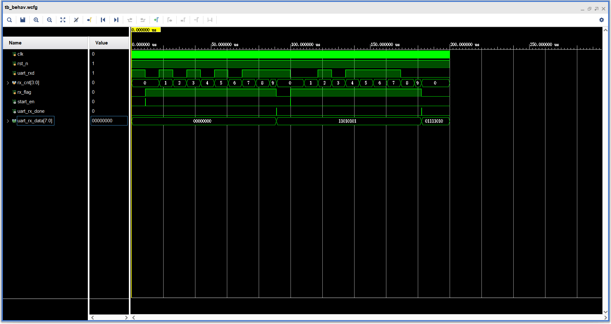
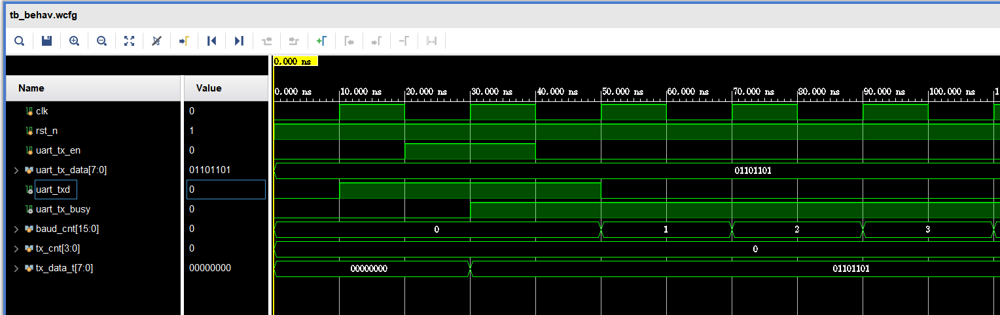
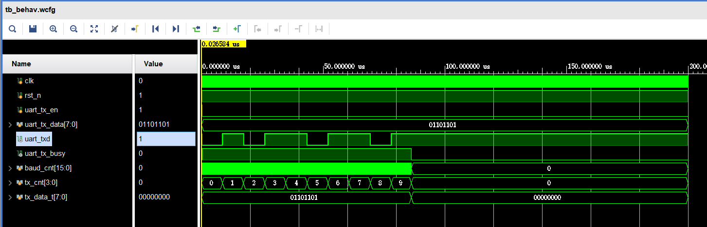
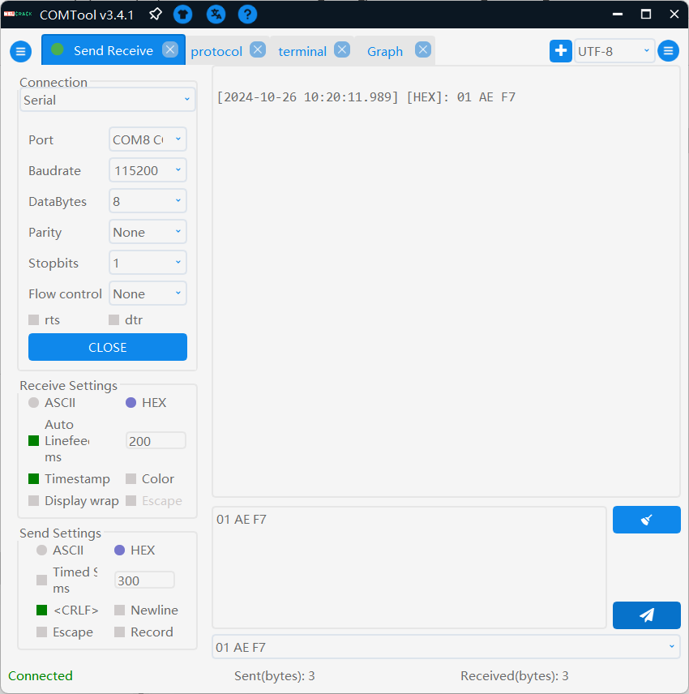
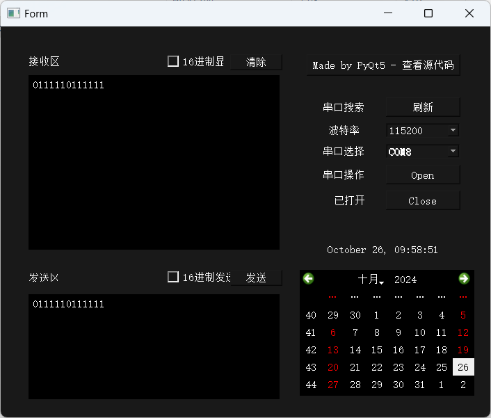

# UART做逻辑分析仪

# UART 实现

> https://blog.csdn.net/Ryansweet716/article/details/133100965?fromshare=blogdetail&sharetype=blogdetail&sharerId=133100965&sharerefer=PC&sharesource=r1Way&sharefrom=from_link

## uart_rx

```verilog
`timescale 1ns / 1ps
//////////////////////////////////////////////////////////////////////////////////
// Company: 
// Engineer: 
// 
// Create Date: 2024/10/25 10:08:43
// Design Name: 
// Module Name: uart_rx
// Project Name: 
// Target Devices: 
// Tool Versions: 
// Description: 
// 
// Dependencies: 
// 
// Revision:
// Revision 0.01 - File Created
// Additional Comments:
// 
//////////////////////////////////////////////////////////////////////////////////


module uart_rx(
    input               clk         ,  //系统时钟
    input               rst_n       ,  //系统复位，低有效

    input               uart_rxd    ,  //UART接收端口
    output  reg         uart_rx_done=0,  //UART接收完成信号
    output  reg  [7:0]  uart_rx_data=0   //UART接收到的数据
    );

//parameter define
parameter CLK_FREQ = 50000000;               //系统时钟频率
parameter UART_BPS = 115200  ;               //串口波特率
localparam BAUD_CNT_MAX = CLK_FREQ/UART_BPS; //为得到指定波特率，对系统时钟计数BPS_CNT次 (传输1bit所需时钟数)

//reg define
reg          uart_rxd_d0=1;
reg          uart_rxd_d1=1;
reg          uart_rxd_d2=1;
reg          rx_flag=0    ;  //接收过程标志信号
reg  [3:0 ]  rx_cnt=0     ;  //记录接收了几位
reg  [15:0]  baud_cnt=0   ;  //波特率计数器
reg  [7:0 ]  rx_data_t=8'b0  ;  //接收数据寄存器

//wire define
wire        start_en;

//*****************************************************
//**                    main code
//*****************************************************
//捕获接收端口下降沿(起始位)，得到一个时钟周期的脉冲信号
assign start_en = uart_rxd_d2 & (~uart_rxd_d1) & (~rx_flag);

//针对异步信号的同步处理
always @(posedge clk or negedge rst_n) begin
    if(!rst_n) begin
        uart_rxd_d0 <= 1'b0;
        uart_rxd_d1 <= 1'b0;
        uart_rxd_d2 <= 1'b0;
    end
    else begin
        uart_rxd_d0 <= uart_rxd;
        uart_rxd_d1 <= uart_rxd_d0;
        uart_rxd_d2 <= uart_rxd_d1;
    end
end

//给接收标志赋值 单bit接收标志
always @(posedge clk or negedge rst_n) begin
    if(!rst_n) 
        rx_flag <= 1'b0;
    else if(start_en)    //检测到起始位
        rx_flag <= 1'b1; //接收过程中，标志信号rx_flag拉高，拉高后start_en=0
    //在停止位一半的时候，即接收过程结束，标志信号rx_flag拉低
    else if((rx_cnt == 4'd9) && (baud_cnt == BAUD_CNT_MAX/2 - 1'b1))//到最后一位检测时
        rx_flag <= 1'b0;
    else
        rx_flag <= rx_flag;
end        

//波特率的计数器赋值
always @(posedge clk or negedge rst_n) begin
    if(!rst_n) 
        baud_cnt <= 16'd0;
    else if(rx_flag) begin     //处于接收过程时，波特率计数器（baud_cnt）进行循环计数
        if(baud_cnt < BAUD_CNT_MAX - 1'b1)
            baud_cnt <= baud_cnt + 16'b1;
        else 
            baud_cnt <= 16'd0; //计数达到一个波特率周期后清零
    end    
    else
        baud_cnt <= 16'd0;     //接收过程结束时计数器清零
end

//对接收数据计数器（rx_cnt）进行赋值  
always @(posedge clk or negedge rst_n) begin
    if(!rst_n) 
        rx_cnt <= 4'd0;
    else if(rx_flag) begin                  //处于接收过程时rx_cnt才进行计数
        if(baud_cnt == BAUD_CNT_MAX - 1'b1) //当波特率计数器计数到一个波特率周期时
            rx_cnt <= rx_cnt + 1'b1;        //接收数据计数器加1
        else
            rx_cnt <= rx_cnt;
    end
    else
        rx_cnt <= 4'd0;                     //接收过程结束时计数器清零
end        

//根据rx_cnt来寄存rxd端口的数据
always @(posedge clk or negedge rst_n) begin
    if(!rst_n) 
        rx_data_t <= 8'b0;
    else if(rx_flag) begin                           //系统处于接收过程时
        if(baud_cnt == BAUD_CNT_MAX/2 - 1'b1) begin  //判断baud_cnt是否计数到数据位的中间
           case(rx_cnt)
               4'd1 : rx_data_t[0] <= uart_rxd_d2;   //寄存数据的最低位
               4'd2 : rx_data_t[1] <= uart_rxd_d2;
               4'd3 : rx_data_t[2] <= uart_rxd_d2;
               4'd4 : rx_data_t[3] <= uart_rxd_d2;
               4'd5 : rx_data_t[4] <= uart_rxd_d2;
               4'd6 : rx_data_t[5] <= uart_rxd_d2;
               4'd7 : rx_data_t[6] <= uart_rxd_d2;
               4'd8 : rx_data_t[7] <= uart_rxd_d2;   //寄存数据的高低位
               default : ;
            endcase  
        end
        else
            rx_data_t <= rx_data_t;
    end
    else
        rx_data_t <= 8'b0;
end        

//给接收完成信号和接收到的数据赋值
always @(posedge clk or negedge rst_n) begin
    if(!rst_n) begin
        uart_rx_done <= 1'b0;
        uart_rx_data <= 8'b0;
    end
    //当接收数据计数器计数到停止位，且baud_cnt计数到停止位的中间时
    else if(rx_cnt == 4'd9 && baud_cnt == BAUD_CNT_MAX/2 - 1'b1) begin
        uart_rx_done <= 1'b1     ;  //拉高接收完成信号
        uart_rx_data <= rx_data_t;  //并对UART接收到的数据进行赋值
    end    
    else begin
        uart_rx_done <= 1'b0;
        uart_rx_data <= uart_rx_data;
    end
end

endmodule

```

### tb

simulation runtime 需设置为200000ns

```verilog
`timescale 1ns / 1ps
//////////////////////////////////////////////////////////////////////////////////
// Company: 
// Engineer: 
// 
// Create Date: 2024/10/25 10:10:02
// Design Name: 
// Module Name: tb
// Project Name: 
// Target Devices: 
// Tool Versions: 
// Description: 
// 
// Dependencies: 
// 
// Revision:
// Revision 0.01 - File Created
// Additional Comments:
// 
//////////////////////////////////////////////////////////////////////////////////


module tb(
    );
    
uart_rx uart_rx0(
    .clk(clk)         ,  //系统时钟
    .rst_n(rst_n)       ,  //系统复位，低有效
    .uart_rxd(uart_rxd)    ,  //UART接收端口
    
    .uart_rx_done(uart_rx_done),  //UART接收完成信号
    .uart_rx_data(uart_rx_data)   //UART接收到的数据
    );
    
reg clk=0;
reg rst_n=1;
reg uart_rxd=1;

wire uart_rx_done;
wire [7:0]uart_rx_data;

parameter CLK_FREQ = 50000000;               //系统时钟频率
parameter UART_BPS = 115200  ;               //串口波特率
localparam BAUD_CNT_MAX = CLK_FREQ/UART_BPS; //为得到指定波特率，对系统时钟计数BPS_CNT次 (传输1bit所需时钟数)
parameter delta=1000000000/UART_BPS;
parameter CLK_PERIOD = 20;  // 时钟周期为20ns

always # 10  clk=~clk ;

initial begin
clk=0; 
rst_n=1;
uart_rxd=1;

# delta
uart_rxd<=0;

# delta
uart_rxd<=1;
# delta
uart_rxd<=0;
# delta
uart_rxd<=1;
# delta
uart_rxd<=0;
# delta
uart_rxd<=1;
# delta
uart_rxd<=0;
# delta
uart_rxd<=1;
# delta
uart_rxd<=1;
# delta
uart_rxd<=1;

# (delta/2)
# delta
uart_rxd<=0;
# delta
uart_rxd<=0;
# delta
uart_rxd<=1;
# delta
uart_rxd<=0;
# delta
uart_rxd<=1;
# delta
uart_rxd<=1;
# delta
uart_rxd<=1;
# delta
uart_rxd<=1;
# delta
uart_rxd<=0;

end


endmodule
```

### 结果




## uart_tx

```verilog
module uart_tx(
    input               clk         , //系统时钟
    input               rst_n       , //系统复位，低有效
    input               uart_tx_en  , //UART的发送使能
    input     [7:0]     uart_tx_data, //UART要发送的数据
    output  reg         uart_txd    , //UART发送端口
    output  reg         uart_tx_busy  //发送忙状态信号
    );

//parameter define
parameter CLK_FREQ = 50000000;               //系统时钟频率
parameter UART_BPS = 115200  ;               //串口波特率
localparam BAUD_CNT_MAX = CLK_FREQ/UART_BPS; //为得到指定波特率，对系统时钟计数BPS_CNT次

//reg define
reg  [7:0]  tx_data_t;  //发送数据寄存器
reg  [3:0]  tx_cnt   ;  //发送数据计数器
reg  [15:0] baud_cnt ;  //波特率计数器

//*****************************************************
//**                    main code
//*****************************************************

//当uart_tx_en为高时，寄存输入的并行数据，并拉高BUSY信号
always @(posedge clk or negedge rst_n) begin
    if(!rst_n) begin
        tx_data_t <= 8'b0;
        uart_tx_busy <= 1'b0;
    end
    //发送使能时，寄存要发送的数据，并拉高BUSY信号
    else if(uart_tx_en) begin
        tx_data_t <= uart_tx_data;
        uart_tx_busy <= 1'b1;
    end
    //当计数到停止位结束时，停止发送过程
    else if(tx_cnt == 4'd9 && baud_cnt == BAUD_CNT_MAX - BAUD_CNT_MAX/16) begin
        tx_data_t <= 8'b0;     //清空发送数据寄存器
        uart_tx_busy <= 1'b0;  //并拉低BUSY信号
    end
    else begin
        tx_data_t <= tx_data_t;
        uart_tx_busy <= uart_tx_busy;
    end
end

//波特率的计数器赋值
always @(posedge clk or negedge rst_n) begin
    if(!rst_n) 
        baud_cnt <= 16'd0;
    //当处于发送过程时，波特率计数器（baud_cnt）进行循环计数
    else if(uart_tx_busy) begin
        if(baud_cnt < BAUD_CNT_MAX - 1'b1)
            baud_cnt <= baud_cnt + 16'b1;
        else 
            baud_cnt <= 16'd0; //计数达到一个波特率周期后清零
    end    
    else
        baud_cnt <= 16'd0;     //发送过程结束时计数器清零
end

//tx_cnt进行赋值
always @(posedge clk or negedge rst_n) begin
    if(!rst_n) 
        tx_cnt <= 4'd0;
    else if(uart_tx_busy) begin             //处于发送过程时tx_cnt才进行计数
        if(baud_cnt == BAUD_CNT_MAX - 1'b1) //当波特率计数器计数到一个波特率周期时
            tx_cnt <= tx_cnt + 1'b1;        //发送数据计数器加1
        else
            tx_cnt <= tx_cnt;
    end
    else
        tx_cnt <= 4'd0;                     //发送过程结束时计数器清零
end

//根据tx_cnt来给uart发送端口赋值
always @(posedge clk or negedge rst_n) begin
    if(!rst_n) 
        uart_txd <= 1'b1;//重置时为高电平
    else if(uart_tx_busy) begin
        case(tx_cnt) 
            4'd0 : uart_txd <= 1'b0        ; //起始位
            4'd1 : uart_txd <= tx_data_t[0]; //数据位最低位
            4'd2 : uart_txd <= tx_data_t[1];
            4'd3 : uart_txd <= tx_data_t[2];
            4'd4 : uart_txd <= tx_data_t[3];
            4'd5 : uart_txd <= tx_data_t[4];
            4'd6 : uart_txd <= tx_data_t[5];
            4'd7 : uart_txd <= tx_data_t[6];
            4'd8 : uart_txd <= tx_data_t[7]; //数据位最高位
            4'd9 : uart_txd <= 1'b1        ; //停止位
            default : uart_txd <= 1'b1;
        endcase
    end
    else
        uart_txd <= 1'b1;                    //空闲时发送端口为高电平
end

endmodule
```

### tb

simulation runtime 需设置为200000ns

```verilog
`timescale 1ns / 1ps
//////////////////////////////////////////////////////////////////////////////////
// Company: 
// Engineer: 
// 
// Create Date: 2024/10/25 22:50:18
// Design Name: 
// Module Name: tb
// Project Name: 
// Target Devices: 
// Tool Versions: 
// Description: 
// 
// Dependencies: 
// 
// Revision:
// Revision 0.01 - File Created
// Additional Comments:
// 
//////////////////////////////////////////////////////////////////////////////////


module tb(

);

uart_tx uart_tx0(
    .clk(clk)         , //绯荤粺鏃堕挓
    .rst_n(rst_n)       , //绯荤粺澶嶄綅锛屼綆鏈夋晥
    .uart_tx_en(uart_tx_en)  , //UART鐨勫彂閫佷娇鑳�
    .uart_tx_data(uart_tx_data), //UART瑕佸彂閫佺殑鏁版嵁
    .uart_txd(uart_txd)   , //UART鍙戦�佺鍙�
    .uart_tx_busy(uart_tx_busy) //鍙戦�佸繖鐘舵�佷俊鍙�
);

reg clk=0;
reg rst_n=1;
reg uart_tx_en=0;
reg [7:0] uart_tx_data=8'b0;
wire uart_txd;
wire uart_tx_busy;

always #10 clk=~clk; 


initial begin
clk=0;
rst_n=1;
uart_tx_en=0;
uart_tx_data<=8'b01101101;
#20
uart_tx_en=1;
#20
uart_tx_en=0;
end


endmodule
```

### 结果





## 顶层文件

```verilog
`timescale 1ns / 1ps
//////////////////////////////////////////////////////////////////////////////////
// Company: 
// Engineer: 
// 
// Create Date: 2024/10/26 09:27:43
// Design Name: 
// Module Name: uart
// Project Name: 
// Target Devices: 
// Tool Versions: 
// Description: 
// 
// Dependencies: 
// 
// Revision:
// Revision 0.01 - File Created
// Additional Comments:
// 
//////////////////////////////////////////////////////////////////////////////////


module uart(
input sys_clk,
input sys_rst_n,
input uart_rxd,
output uart_txd
    );
uart_rx_0 my_rx(
  .clk(sys_clk),                    // input wire clk
  .rst_n(sys_rst_n),                // input wire rst_n
  .uart_rxd(uart_rxd),          // input wire uart_rxd
  .uart_rx_done(uart_rx_done),  // output wire uart_rx_done
  .uart_rx_data(uart_rx_data)  // output wire [7 : 0] uart_rx_data
);

wire uart_rx_done;
wire [7:0] uart_rx_data;

uart_tx_0 my_tx(
  .clk(sys_clk),                    // input wire clk
  .rst_n(sys_rst_n),                // input wire rst_n
  .uart_tx_en(uart_rx_done),      // input wire uart_tx_en
  .uart_tx_data(uart_rx_data),  // input wire [7 : 0] uart_tx_data
  .uart_txd(uart_txd)          // output wire uart_txd
);


endmodule

```

### 约束文件

基于达芬奇xc7a35tfgg484-2

```xdc
#时序约束
create_clock -period 20.000 -name sys_clk [get_ports sys_clk]

#IO引脚约束
#------------------------------系统时钟和复位-----------------------------------
set_property -dict {PACKAGE_PIN R4 IOSTANDARD LVCMOS33} [get_ports sys_clk]
set_property -dict {PACKAGE_PIN U2 IOSTANDARD LVCMOS33} [get_ports sys_rst_n]

#-----------------------------------UART----------------------------------------
set_property -dict {PACKAGE_PIN U5 IOSTANDARD LVCMOS33} [get_ports uart_rxd]
set_property -dict {PACKAGE_PIN T6 IOSTANDARD LVCMOS33} [get_ports uart_txd]
```

## 串口调试助手

二选一

* [Neutree/COMTool: Cross platform communicate assistant（更全能）](https://github.com/Neutree/COMTool)



* [Oslomayor/PyQt5-SerialPort-Stable（使用更简单，默认数据位为8位）](https://github.com/Oslomayor/PyQt5-SerialPort-Stable)


