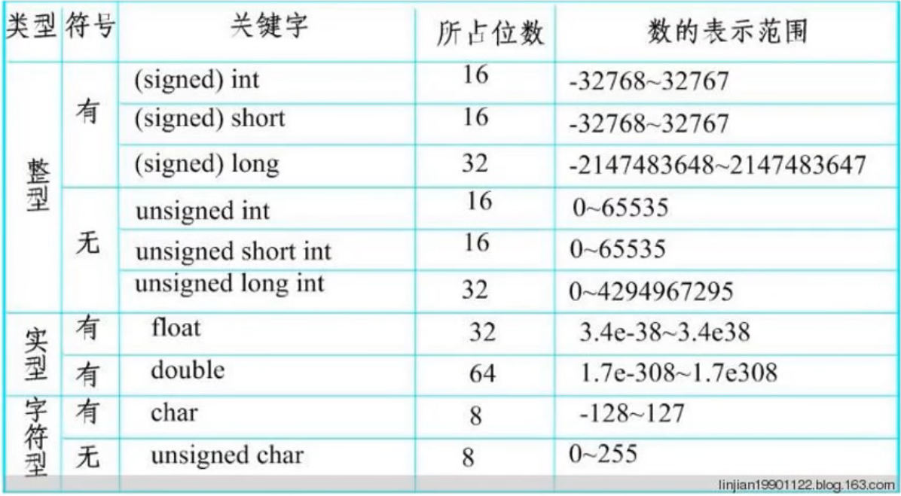
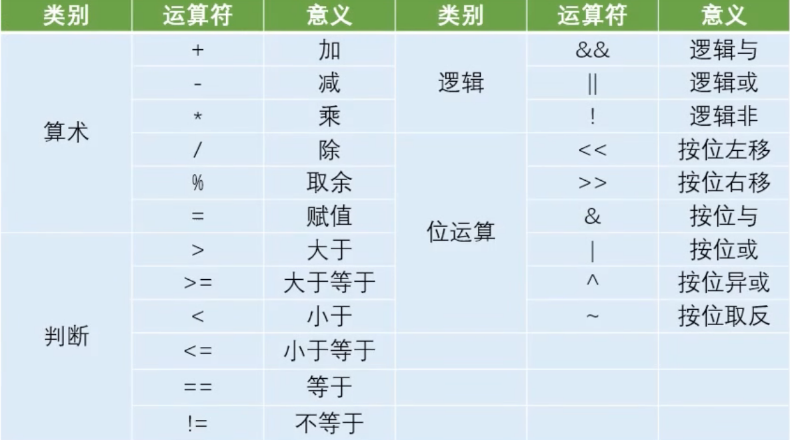

## 51单片机学习

## 关键路径

F:\Keil_v5\C51\INC
F:\Keil_v5\C51\INC\Atmel

## C51数据类型



## C51数据运算



### 创建项目

* keil->project->new uvision project 记得创建一个新的文件夹

* 选择atmel->AT89C52

  > 会问你是否copy 一个东西，是或否都可以点

* 左侧Protject窗口->target->Source Group1 鼠标右键 `Add new item to ···` 选择c，名字取为main

### 写代码
* workspace区域 鼠标右键 `insert #inlcude<REGX52.H>`添加头文件

* 可通过在`#include<REGX52.H>`处右键，查看各个接口

  > sfr为寄存器

点亮led灯

	> 管脚从A2开发板原理图上找
	>
	> P2记得大写P

```c
#include <REGX52.H>

void main()
{
	P2=0xFE;//最低位（0xFE的最右边一位）为P2_0，即P0
}
```

* 点击左上角`build`（第二个按钮）

  > 其左边为translate(编译)

### 烧录

* STC-ISP 左上角，单片机型号选择（根据实际情况）atmel->STC89C52RC/LE52RC
* 串口号选择最长的那个 USB-SERTAL CH340（COM8）

* 打开程序文件（.hex文件）

  > keil编译时默认不生成.hex文件，需在translate、build那一行有一个长得像魔法棒的按钮  options for target->Output->勾选Create HEX File

* 点击下载/编程

  > 若右边信息框显示正在搜索单片机，关闭单片机（按一下白色杆状按钮），点击下载/编程，立马打开单片机。

* 重新打开项目

  > Project->Open project-> .uvproj文件

## 样例

### LED闪烁

* STC-ISP 右上角点击右箭头，软件延时计算器，输入需要的定时长度

	> `main.c(6): warning C206: '_nop_': missing function-prototype`报错
	>
	> 添加`#include <INTRINS.H>`
	>
	> (#include 与 <INTRINS.H> 间要有个空格)
	
### LED流水灯

*  通过STC-iSP软件延时计算器(不是定时器计算器)，输入需要的定时长度，系统频率选择11.0592（看单片机上的晶振的频率），8051指令集选STC-Y1

```c
#include <REGX52.H>
#include <INTRINS.H>
void Delay500ms()		//@11.0592MHz
{
	unsigned char i, j, k;

	_nop_();
	i = 4;
	j = 129;
	k = 119;
	do
	{
		do
		{
			while (--k);
		} while (--j);
	} while (--i);
}


void main()
{
	while(1)
	{
		P2=0xFE;
		Delay500ms();
		P2=0xFD;
		Delay500ms();
		P2=0xFB;
		Delay500ms();
		P2=0xF7;
		Delay500ms();
	}
}
```

### 独立按键控制LED灯亮灭

```c
#include <REGX52.H>

void main()
{
    while(1)
    {
        if(P3_1==1)
        {
            P2_0=0;
        }
        else
        {
            P2_0=1;
        }
	}
}
```

* P3_1==1代表未按按键，P3_1 ==0代表按键按下(按下，导通，P3_1接GND)

### 独立按键控制LED灯状态

```c
#include <STC89C5xRC.H>
 
void Delay(unsigned int xms)		//@12.000MHz
{
	unsigned char i, j;
	while(xms)
	{
	i = 2;
	j = 239;
	do
	{
		while (--j);
	} while (--i);
	xms--;
	}
}
 
 
void main()
{
	while(1)
	{
		if(P31==0)
		{
			Delay(20);  // Keys away shaking
			while(P31==0);//未松手
			Delay(20);  // Detection of let go
			P20=~P20;
		}
	}
}
```

### 独立按键控制LED显示二进制

```c
#include <REGX52.H>
#include <INTRINS.H>

void Delay20ms()		//@11.0592MHz
{
	unsigned char i, j, k;

	_nop_();
	_nop_();
	i = 1;
	j = 216;
	k = 35;
	do
	{
		do
		{
			while (--k);
		} while (--j);
	} while (--i);
}

void main()
{
	while(1)
	{
			if(P3_1==0)
			{
				Delay20ms();
				while(P3_1==0);
				Delay20ms();
				P2=~P2;
				P2++;
				P2=~P2;
			}
			
	}
}
```

### 独立按键控制LED移位

按下P31，往左边移一位；按下P30，往右边移一位，以LED灯来展示。

```c
#include <REGX52.H>
#include <INTRINS.H>

void Delay20ms()		//@11.0592MHz
{
	unsigned char i, j, k;

	_nop_();
	_nop_();
	i = 1;
	j = 216;
	k = 35;
	do
	{
		do
		{
			while (--k);
		} while (--j);
	} while (--i);
}

void main()
{
	int lit=0;
	P2=0x01<<lit;
	while(1)
	{
		if(P3_0==0)//left
		{
			Delay20ms();
			while(P3_0==0);
			Delay20ms();
			if(lit==7)
				lit=0;
			else
				lit++;
		}
		if(P3_1==0)//right
		{
			Delay20ms();
			while(P3_1==0);
			Delay20ms();
			if(lit==0)
				lit=7;
			else
				lit--;
		}
		P2=~(0x01<<lit);
	}
}
```

* 0x01<<lit 表示0x01左移lit位

### 静态数码管显示

```c
#include <REGX52.H>

unsigned char NixieTable[]={//ÄÄЩÊýÂë¹ÜÏÔʾ
 
0x3f,0x06,0x5b,0x4f,
 
0x66,0x6d,0x7d,0x07,
 
0x7f,0x6f,0x77,0x7c,
 
0x39,0x5e,0x79,0x71, 0x00};

void Nixie(unsigned char which,num)
{
	//whichÊÇ´Ó×óÍùÓÒÊýµÚ¼¸¸öµÆ
	switch(which)//choose light
	{
		case 1:P2_4=1,P2_3=1,P2_2=1;	break;//LED8
		case 2:P2_4=1,P2_3=1,P2_2=0;break;
		case 3:P2_4=1,P2_3=0,P2_2=1;break;
		case 4:P2_4=1,P2_3=0,P2_2=0;break;
		case 5:P2_4=0,P2_3=1,P2_2=1;break;
		case 6:P2_4=0,P2_3=1,P2_2=0;break;
		case 7:P2_4=0,P2_3=0,P2_2=1;break;
		case 8:P2_4=0,P2_3=0,P2_2=0;break;
		default:P2_4=0,P2_3=0,P2_2=0;break;
	}
	P0=NixieTable[num];
}	

void main()
{
	while(1)
	{
		Nixie(5,6);
	}
}
```

* NixieTable用来记录一位数码管显示某个数字时，具体是那几根数码管亮，对应的引脚是什么。
* 位选，段选

### 动态数码管显示

```c
#include <REGX52.H>
#include <INTRINS.H>

void Delay(unsigned char time)		//@11.0592MHz
{
	unsigned char i, j;

	_nop_();
	_nop_();
	_nop_();
	while(time--)
	{
		i = 11;
		j = 190;
		do
		{
			while (--j);
		} while (--i);
	}
}

unsigned char NixieTable[]={
 
0x3f,0x06,0x5b,0x4f,
 
0x66,0x6d,0x7d,0x07,
 
0x7f,0x6f,0x77,0x7c,
 
0x39,0x5e,0x79,0x71, 0x00};

void Nixie(unsigned char which,num)
{
	switch(which)//choose light
	{
		case 1:P2_4=1,P2_3=1,P2_2=1;	break;//LED8
		case 2:P2_4=1,P2_3=1,P2_2=0;break;
		case 3:P2_4=1,P2_3=0,P2_2=1;break;
		case 4:P2_4=1,P2_3=0,P2_2=0;break;
		case 5:P2_4=0,P2_3=1,P2_2=1;break;
		case 6:P2_4=0,P2_3=1,P2_2=0;break;
		case 7:P2_4=0,P2_3=0,P2_2=1;break;
		case 8:P2_4=0,P2_3=0,P2_2=0;break;
		default:P2_4=0,P2_3=0,P2_2=0;break;
	}
	P0=NixieTable[num];
	Delay(1);
	P0=0x00;
}	

void main()
{
	while(1)
	{
		Nixie(1,1);
		Nixie(2,2);
		Nixie(3,3);
	}
}
```

* `	Delay(1);` 是为了保持该数据
* `P0=0x00;`是为了置零消除残影

### 矩阵键盘密码锁

`main.c`

```c
#include <REGX52.H>
#include <INTRINS.H>
#include "Delay.h"
#include "MatrixKey.h"
#include "Nixie.h"
#include "tool.h"

void main()
{
	unsigned char i = 0;

	while (1)
	{
		if (password()==1)
		{

			while (keyNum() != 11)
			{
				for (i = 5; i <= 8; i++)
				{
					Nixie(i, 10);
				}
			}
			break;
		}
		else
		{
			while (keyNum() != 11)
			{
				for (i = 5; i <= 8; i++)
				{
					Nixie(i, 15);
				}
			}
			break;
		}
	}
}
```

`unsigned char password()`

```c
#include "tool.h"
unsigned char password()
{

    unsigned char i = 0;
    unsigned char nums = 2, this, passWord = 0, realPassWord = 11;

    for (i = 0; i < nums; i++)
    {
        while ((this = keyNum()) == 0)
        {
            if (i == 0)
                Nixie(1, 14);
            else
                show(passWord);
        }
        passWord = passWord * 10 + this;
    }

    while (keyNum() != 12) // 确认
    {
        show(passWord);
    }

    if (passWord == realPassWord)
    {
        return 1;
    }
    else // wrong password
    {
        return 0;
    }
}
```

* 单片机没有标GND的地方，默认接高电平
* C语言的旧版本中变量声明必须在函数或任何作用域的开头

### 按键控制流水灯模式

```c
#include <REGX52.H>
#include <INTRINS.H>
#include "Delay.h"
#include "MatrixKey.h"
#include "Nixie.h"
#include "tool.h"

unsigned int T0Count = 0;
unsigned char lightMode = 0;

void Timer0_Rountine(void) interrupt 1
{
	T0Count++;
	TL0 = 0x66; // 设置定时初值
	TH0 = 0xFC; // 设置定时初值
	if (T0Count == 1000)
	{
		switch (lightMode)
		{
			case 1:
				P2 = _cror_(P2, 1);
				break;
			case 2:
				P2 = _crol_(P2, 1);
				break;
			default:
				break;
		}
		T0Count = 0;
	}
}


void main()
{
	Timer0Init();
	P2 = 0xFE;
	while (1)
	{
		if (key()==1)
		{
			lightMode++;
			if (lightMode >= 3)
			{
				lightMode = 0;
			}
		}
	}
}

```

`Timer0Init()`

```c
void Timer0Init(void) // 1毫秒@11.0592MHz
{
    // AUXR |= 0x80;		//定时器时钟1T模式
    TMOD = 0x01; // 设置定时器模式
	TL0 = 0x66;		//设置定时初值
	TH0 = 0xFC;		//设置定时初值
    TF0 = 0;     // 清除TF0标志
    TR0 = 1;     // 定时器0开始计时
    ET0 = 1;
    EA = 1;
    PT0=0;
}
```

> stc-isp 定时器选择 12T,16位。

### 定时器时钟

```c
#include <REGX52.H>
#include <INTRINS.H>
#include "Delay.h"
#include "MatrixKey.h"
#include "Nixie.h"
#include "tool.h"

unsigned int T0Count = 0;
unsigned char lightMode = 0;
unsigned char hour, min=59, sec=45;

void Timer0_Rountine(void) interrupt 1
{
	T0Count++;
	TL0 = 0x66; // 设置定时初值
	TH0 = 0xFC; // 设置定时初值
	if (T0Count == 1000)
	{
		sec++;
		if (sec >= 60)
		{
			sec = 0;
			min++;
		}
		if (min >= 60)
		{
			min = 0;
			hour++;
		}
		if (hour >= 24)
		{
			hour = 0;
		}
		T0Count = 0;
	}
}

void main()
{
	Timer0Init();
	while (1)
	{
		// hour
		if (hour < 10)
		{
			Nixie(1, 0);
			Nixie(2, hour);
			Nixie(2, 17);
		}
		else
		{
			showPos(hour, 1);
			Nixie(4, 17);
		}

		// min
		if (min < 10)
		{
			Nixie(3, 0);
			Nixie(4, min);
			Nixie(4, 17);
		}
		else
		{
			showPos(min, 3);
			Nixie(4, 17);
		}

		// sec
		if (sec < 10)
		{
			Nixie(5, 0);
			Nixie(6, sec);
		}
		else
		{
			showPos(sec, 5);
		}
		
	}
}

```

* 记得在main里放`Timer0Init();`不然定时器会不起作用


## 警告/报错

* `main.c(6): warning C206: '_nop_': missing function-prototype`

  >  添加`#include <INTRINS.H>`

* `uncalled segment`

  > 会调用定义过的函数

* 如果.hex文件更新不了，请检查保存的文件夹是否是你认为的地方(`Select Folder for Objects`)

* \#include <REGX52.H>下划线标红

  `Ctrl+Shift+P` 打开命令面板，运行 `C/Cpp: Edit configurations`，打开UI，添加路径REGX52.h所在路径

  > http://t.csdnimg.cn/sn8s1

* 出现大量undefined identifier

  C语言的旧版本中变量声明必须在函数或任何作用域的开头

> [keil编译时出现大量莫名其妙的 undefined identifier_keil4 加了头文件 外部声明了 为什么还报错 'sdate': undefined identi-CSDN博客](https://blog.csdn.net/Gelercat/article/details/131017611)

* 若vscode检测不到新创建的工程

  应当先用keil5 build，再检查是否生成.hex文件，然后重复打开几次
