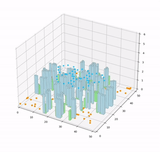
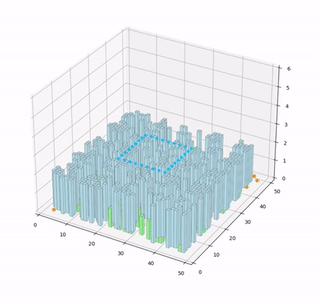

# DQN

## 训练平台

> [Gymnasium Documentation](https://gymnasium.farama.org/)
>
> [Lyytimmy/UAVGym: UAVGym是一个用python编写的GYM风格的无人机仿真环境，用于强化学习算法的研究。](https://github.com/Lyytimmy/UAVGym)





``` python
import gym
import numpy as np
import torch
import torch.nn as nn
import torch.optim as optim
import matplotlib.pyplot as plt

# 定义DQN网络结构
class DQN(nn.Module):
    def __init__(self, input_size, hidden_size, output_size):
        super(DQN, self).__init__()
        self.linear1 = nn.Linear(input_size, hidden_size)
        self.linear2 = nn.Linear(hidden_size, output_size)
    
    def forward(self, x):
        x = torch.relu(self.linear1(x))
        x = self.linear2(x)
        return x

# 超参数
input_size = 10  # 假设状态空间的维度为10
hidden_size = 128  # 隐藏层神经元数量
output_size = 4  # 假设动作空间的维度为4
learning_rate = 0.001
gamma = 0.9  # 折扣因子
epsilon = 0.1  # 探索率
epsilon_decay = 0.99  # 探索率衰减
epsilon_min = 0.01  # 最小探索率

# 初始化网络和优化器
policy_net = DQN(input_size, hidden_size, output_size)
target_net = DQN(input_size, hidden_size, output_size)
target_net.load_state_dict(policy_net.state_dict())
target_net.eval()
optimizer = optim.Adam(policy_net.parameters(), lr=learning_rate)

# 训练循环
num_episodes = 500
for episode in range(num_episodes):
    state = env.reset()
    state = torch.tensor(state, dtype=torch.float32)
    done = False
    rewards = 0
    while not done:
        # 选择动作
        if np.random.rand() < epsilon:
            action = np.random.randint(0, output_size)
        else:
            action = policy_net(state)
            action = action.argmax().item()
        
        # 执行动作
        next_state, reward, done, _ = env.step(action)
        next_state = torch.tensor(next_state, dtype=torch.float32)
        rewards += reward
        
        # 计算目标Q值
        target = reward + gamma * target_net(next_state).max(1)[0].view(1, -1)
        
        # 计算当前Q值
        current_q = policy_net(state)[action]
        
        # 计算损失
        loss = (target - current_q) ** 2
        
        # 优化
        optimizer.zero_grad()
        loss.backward()
        optimizer.step()
        
        # 更新状态
        state = next_state
        
        # 更新探索率
        epsilon = max(epsilon_min, epsilon * epsilon_decay)
    
    print(f'Episode {episode+1}, Total reward: {rewards}')

# 保存模型
torch.save(policy_net.state_dict(), 'dqn_drone.pth')
```

