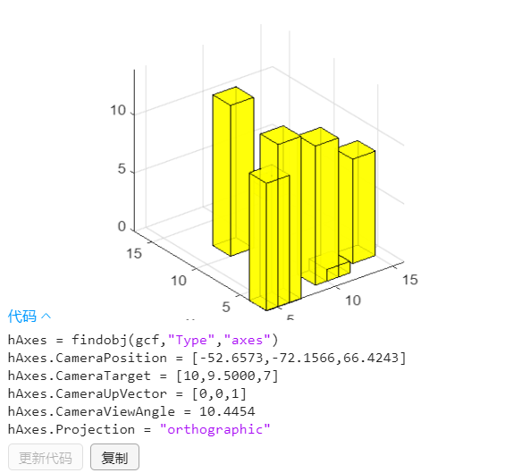

##  matlab三维路径规划绘图.md



### 绘制立方体

```matlab
hold on
grid on
plotcube([5 5 5],[ 2 2 2],.8,[1 0 0]);
plotcube([2 1 3],[ 10 10 10],.8,[144/256 144/256 144/256]);
axis([0 2000 0 2000 -200 600 ])   %设置图像的可视化范围

axis equal     % 图像坐标轴可视化间隔相等 
xlabel('x');
ylabel('y');
```

`plotcube([长，宽，高]，[x,y,z坐标] , 透明度0~1 , [r , g ,b 0~1] );`

### 绘制立方柱

```matlab
clc
clear
close all
hold on
grid on
rows=7;
place=randi(15,rows,2);
height=randi(15,rows,1);
for i=1:rows
    plotcube([2,2,height(i)],[place(i,:),0],0.8,[1 1 0]);
end

axis([0 2000 0 2000 -200 600 ])   %设置图像的可视化范围
axis equal     % 图像坐标轴可视化间隔相等 
xlabel('x');ylabel('y');

```

### 自由视角

命令行输入` cameratoolbar`

### 生成随机数矩阵

`randi(max,rows,cols)` 生成rows *cols的1~max的随机数矩阵
